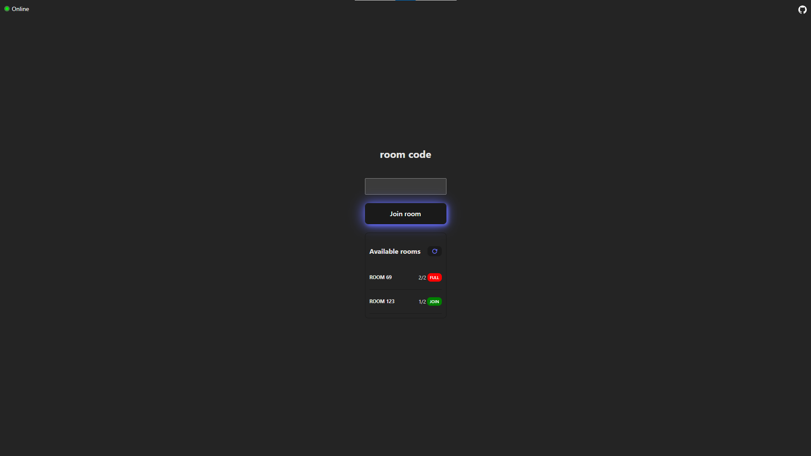

 

  

  <h3 align="center">xoOnline </h3>

  

    A simple multiplayer tic-tac-toe game made using React + Vite, SASS, Node.js, Express and socket.io
     
     
    <a href="https://github.com/MDBossss/xoOnline">View Demo</a>
    .
    <a href="https://github.com/MDBossss/xoOnline/issues">Report Bug</a>
    .
    <a href="https://github.com/MDBossss/xoOnline/issues">Request Feature</a>
  

   

## About The Project

xoOnline is an upgraded version of the classic Tic-Tac-Toe game, originally found in the official React.js documentation. This project serves as a practical learning resource and an opportunity to delve into socket.io.

Key Features:

* Room Creation and Connection: Users can create new rooms and seamlessly connect to existing ones, facilitating multiplayer gameplay.

* Room Listing and Quick Join: Browse and join available rooms swiftly, making it easy to find opponents and start playing.

* Game Abortion on Player Disconnection: If a player leaves the game abruptly, the system intelligently aborts the ongoing game to ensure fairness and a smooth user experience.

* Essential Functionality: The game incorporates essential features such as win/tie detection, game reset, and a play-again option.

Future Enhancements:

* Leaderboard and Points System: I have plans to introduce a comprehensive leaderboard, enabling players to track their progress and compete with others. A points system will enhance the overall gaming experience and foster a sense of achievement.
