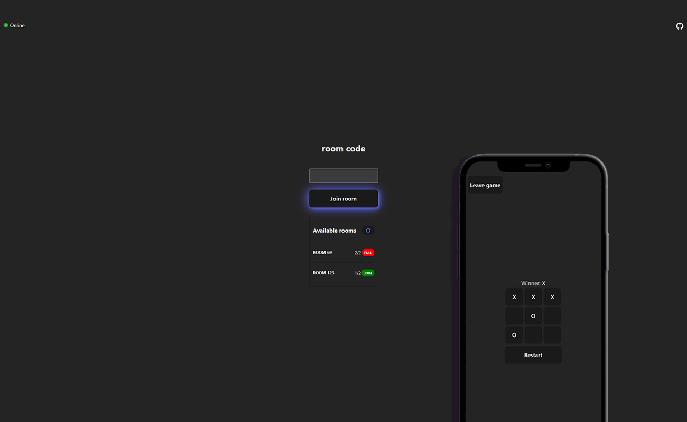

<br/>
<p align="center">
  <a href="https://github.com/MDBossss/xoOnline">
    
  </a>

  <h1 align="center">xoOnline - TicTacToe game</h1>

  <p align="center">
    A simple multiplayer tic-tac-toe game made using React + Vite, SASS, Node.js, Express and socket.io
    <br/>
    <br/>
    <a href="https://github.com/MDBossss/xoOnline">View Demo</a>
    .
    <a href="https://github.com/MDBossss/xoOnline/issues">Report Bug</a>
    .
    <a href="https://github.com/MDBossss/xoOnline/issues">Request Feature</a>
  </p>
</p>

   

## About The Project



xoOnline is an upgraded version of the classic Tic-Tac-Toe game, originally found in the official React.js [documentation](https://react.dev/learn/tutorial-tic-tac-toe). This project serves as a practical learning resource and an opportunity to delve into socket.io.

Key Features:

* Room Creation and Connection: Users can create new rooms and seamlessly connect to existing ones, facilitating multiplayer gameplay.

* Room Listing and Quick Join: Browse and join available rooms swiftly, making it easy to find opponents and start playing.

* Game Abortion on Player Disconnection: If a player leaves the game abruptly, the system intelligently aborts the ongoing game to ensure fairness and a smooth user experience.

* Essential Functionality: The game incorporates essential features such as win/tie detection, game reset, and a play-again option.


Future Enhancements:

* Leaderboard and Points System: I have plans to introduce a comprehensive leaderboard, enabling players to track their progress and compete with others. A points system will enhance the overall gaming experience and foster a sense of achievement.


## Technologies

### Frontend
* React + Vite
* SASS
* socket.io

### Backend
* Node.js
* Express.js
* socket.io


## Setting up environmental variables

To run the project, you will need to set up environmental variables. Follow the instructions below:

### client
Create a `.env` file inside the client directory and define the following variables:
```
VITE_SERVER_URL=http://localhost:5000
```

## Installation
To get started with xoOnline, follow these steps:

1. Clone the repository
2. Install the dependencies for both the server and the client by running `yarn install` in their respective directories.
3. Configure the environmental variables as described in the previous section.
4. Start the server by running `yarn run start` in the server directory.
5. Start the client by running `yarn run dev` in the client directory.

## Contributing

Contributions are what make the open source community such an amazing place to be learn, inspire, and create. Any contributions you make are **greatly appreciated**.
* If you have suggestions for adding or removing projects, feel free to [open an issue](https://github.com/MDBossss/xoOnline/issues/new) to discuss it, or directly create a pull request after you edit the *README.md* file with necessary changes.
* Please make sure you check your spelling and grammar.
* Create individual PR for each suggestion.
* Please also read through the [Code Of Conduct](https://github.com/MDBossss/xoOnline/blob/main/CODE_OF_CONDUCT.md) before posting your first idea as well.

### Creating A Pull Request

1. Fork the Project
2. Create your Feature Branch (`git checkout -b feature/AmazingFeature`)
3. Commit your Changes (`git commit -m 'Add some AmazingFeature'`)
4. Push to the Branch (`git push origin feature/AmazingFeature`)
5. Open a Pull Request

## License

Distributed under the MIT License. See [LICENSE](https://github.com/MDBossss/xoOnline/blob/main/LICENSE.md) for more information.
